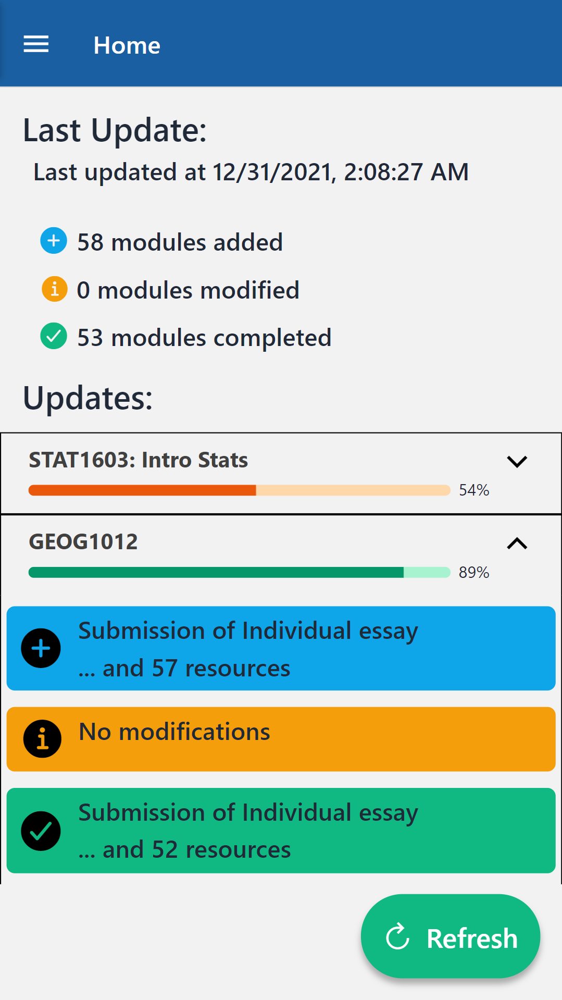
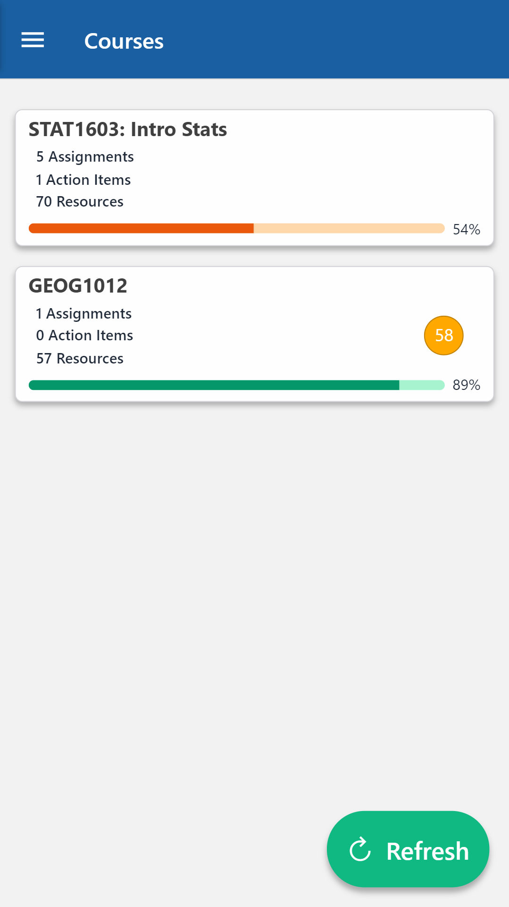
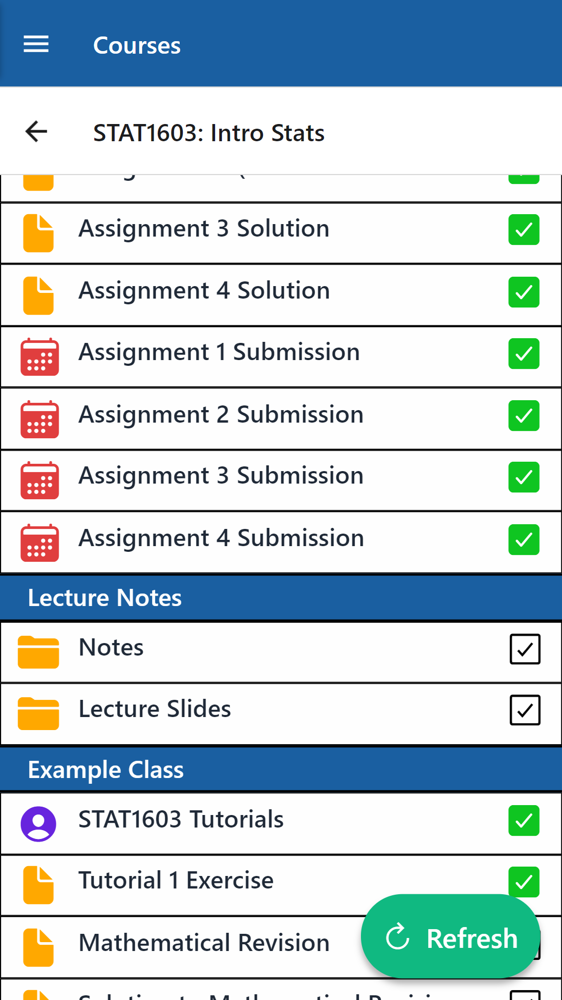
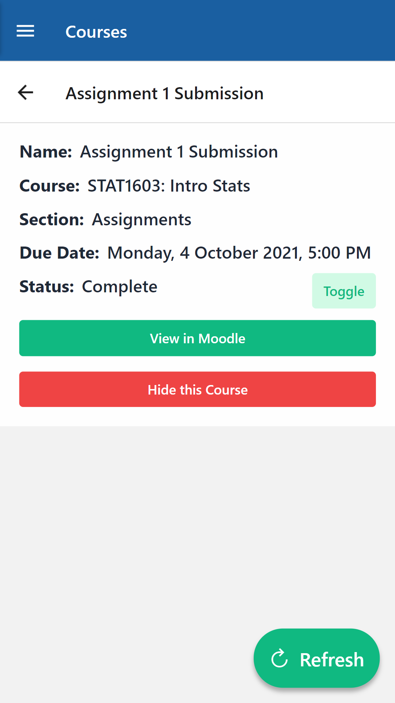
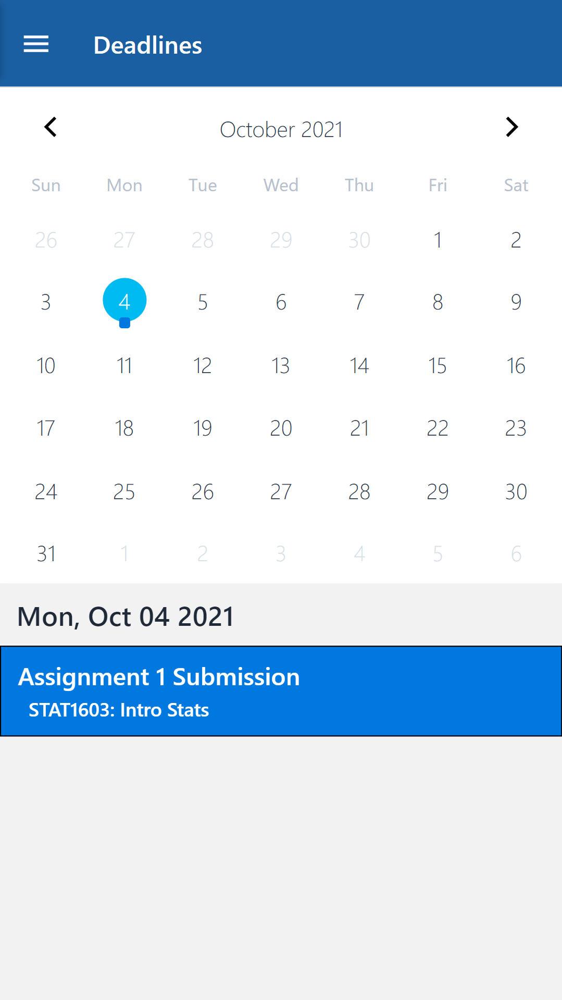
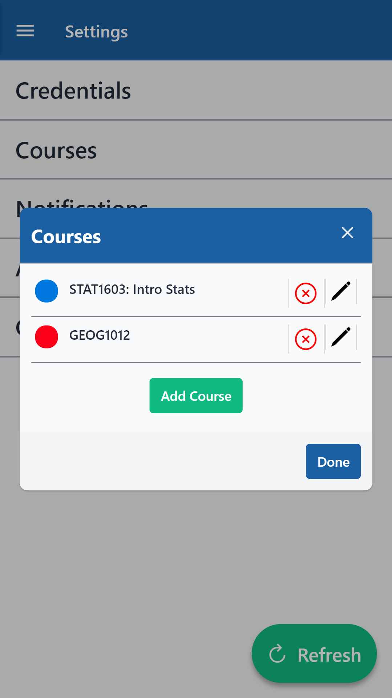
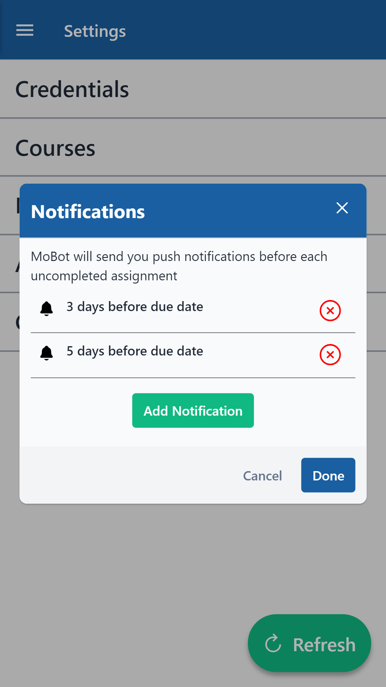

# Mobot

Mobot is a mobile application that allows you to keep track of your HKU Moodle content. This includes keeping track of your coursework as well as assignment deadlines. Mobot retrieves your information by reverse engineering Moodle and scraping the HTMLs returned from HKU's HTTP server.

    

## Data Usage

Mobot stores all course-related, non-sensitive information locally on your device. No user data is stored.

User credentials are not saved on device for security purposes. You will be prompted to input your credentials for each app session.

## Dashboard

The dashboard page displays key information from each refresh. Performing a refresh will update the course content on your device and display the changes made.

## Courses

The courses page gives you an overview of your courses.

By clicking into a course, one can view all the modules on Moodle for that course. Clicking into modules provides detailed information about the module and allows users to view it in Moodle as well.

## Deadlines

Track your submission due dates with the deadline calendars

## User Settings

Users can add up to **6 courses** at a time. Simply copy paste the course's Moodle URL into the app and give it a name to reference it by.

Users can also create custom notifications for assignments and receive push notification reminders on their device for each submission.

